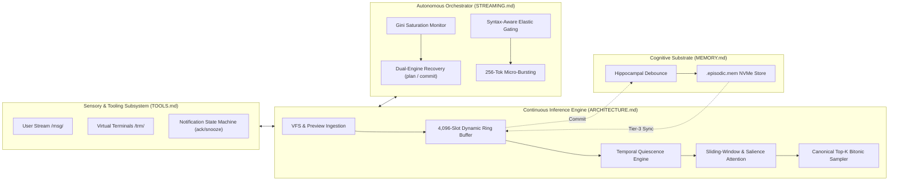

# Features & Technical Architecture Guide

## 1. Introduction & Problem Statement

Modern Large Language Model (LLM) inference engines (e.g. standard implementations of vLLM, Ollama, llama.cpp) are built around a **monolithic, request-response batch processing paradigm**. In this classical model:
- The user provides an entire turn of text.
- The engine computes a dense, compute-heavy prefill across the whole prompt.
- The model enters an uninterrupted autoregressive loop generating hundreds or thousands of tokens.
- At the end of the turn, the conversation is either linearly accumulated until the context window explodes, or naively truncated using FIFO eviction.
- Between sessions or context resets, the engine is completely amnesic; the weights are read-only, and all high-dimensional reasoning state is discarded.

As detailed in [PROBLEM.md](PROBLEM.md), this monolithic foundation creates three fundamental systemic failures:
1. **The Streaming Bottleneck**: Inability to handle continuous, real-time sensory inputs (keystrokes, audio frames, terminal updates) without pipeline stalls or context shockwaves.
2. **The Memory & Amnesia Bottleneck**: High VRAM consumption and severe attention degradation ("lost in the middle") caused by context-stuffing (RAG), which converts rich latent representations back into lossy natural language strings.
3. **The Compute & Bandwidth Wall**: Executing every single transformer layer uniformly for every token, regardless of whether the token is mundane whitespace or complex algorithmic reasoning.

This project introduces a **Streaming Hierarchical Architecture** designed for continuous, full-duplex inference, autonomous orchestration, and persistent cognitive memory.

---

## 2. High-Level Solution Overview

This engine replaces the monolithic request-response cycle with an interleaved, event-driven sensory-motor loop:

1. **Hardware-Tailored Execution**: Written in pure Zig and compiled to direct Vulkan 1.3 compute shaders, targeting AMD Unified Memory Architecture (UMA) with zero CPU-GPU copy overhead.
2. **Deterministic Working Memory**: Bounded to a strict 4,096-slot dynamic ring buffer per layer that never overflows, eliminates positional aliasing, and dynamically evicts low-salience tokens.
3. **Continuous Streaming Transduction**: Elastic micro-bursts that respect syntactic resting points, suppress runaway meta-cognitive loops, and allow seamless user barge-in without destroying in-flight thought state.
4. **Dual-Engine Cognitive Memory**: Combines executive symbolic task management (`plan`) with latent FP16 $(K, V)$ episodic persistence (`.episodic.mem`), eliminating the text re-encoding penalty of traditional RAG.
5. **Unix VFS & Notification Architecture**: Unifies all incoming sensory inputs into a virtual file subsystem with ~32-token notification previews, fast-path subshell execution ($\le 250\text{ ms}$), and an explicit interrupt queue (`ack`/`snooze`).

---

## 3. Core Architectural Features & Innovations

### A. The 4,096-Slot Dynamic Ring Buffer & Sliding-Window Geometry
*For low-level data structures and ring math, see [ARCHITECTURE.md](ARCHITECTURE.md).*

* **Fixed Working Set Allocation**: Rather than allocating an unbounded KV cache that exhausts VRAM, every layer allocates exactly 4,096 physical slots (~768 MB total for Gemma 4 12B across 48 layers).
* **Depth-Asymmetric Partitioning**:
  - **Tier 1 (Dynamic System Anchors)**: Permanent slots ($0 \dots N_{\text{sys}}-1$) holding immutable procedural rules, tool schemas, and persona instructions. Locked forever; never evicted.
  - **Tier 2 (Sliding FIFO / Working Context)**: Circular buffer holding immediate conversational turns and working scratchpad thoughts.
  - **Tier 3 (Associative Recall Slots)**: Upper reasoning layers ($L_{16}\dots L_{47}$) reserve slots for subconscious episodic memory injection.
* **Sliding-Window Layer Decoupling**: Gemma 4 combines 40 sliding-window layers ($W=1024$) with 8 full-attention layers. The engine strictly enforces sliding-window boundaries in GPU shaders, preventing high-frequency RoPE positional phase-decoherence while allowing full-attention layers to maintain global anchor context.

---

### B. Hardware-Tailored Vulkan 1.3 Compute Engine (AMD UMA)
*For kernel execution specs, dispatch patterns, and tiling math, see [ENGINEERING.md](ENGINEERING.md).*

* **Zero-Copy Shared UMA**: Eliminates discrete PCIe host-to-device transfers. Model weights, KV ring buffers, and output tensors reside in unified LPDDR5X memory directly accessible to both CPU threads and the Radeon 8060S compute cores.
* **Pure Symmetric Q4_0 Linear Projections**: Complete quantization across all projection matrices ($Q, K, V, O$, `gate`, `up`, `down`), matching official weights and achieving $\ge 24\text{ tok/s}$ generation speed.
* **Fused Kernel Pipelines**:
  - `fused_qkv_q4`: Combines input RMSNorm and Q/K/V projections into a single dispatch.
  - `fused_mlp_q4`: Fuses gate/up projections, SwiGLU activation, and down projection with cooperative subgroup tiling ($64\times 32$).
  - `decode_attn`: Unrolled 8-wide burst accumulation utilizing 128-bit memory loads, dropping 48-layer attention decode time from $8.6\text{ ms}$ to under $3.0\text{ ms}$.
* **On-Device Bitonic Top-64 Reduction**: Evaluates logit softcapping ($30.0$) and Top-64 selection entirely on the GPU, transferring only the final candidate array to the CPU and saving over 1 MB of memory traffic per generated token.

---

### C. Multi-Scale Temporal Quiescence
*For mathematical derivations and layer-skipping criteria, see [APPROACH.md](APPROACH.md).*

* **Event-Driven Computation**: In classical transformers, every layer runs for every token. In this engine, layers monitor the state drift vector:
  $$\|\Delta h^{(l)}\| = \|h^{(l)} - h^{(l-1)}\|$$
* **Dynamic Layer Gating**: When incoming inputs or intermediate activations represent predictable or mundane syntax, higher reasoning layers can conditionally skip execution, saving memory bandwidth and compute cycles.

---

### D. Attention-Mass Accumulation & Salience Eviction
*For mathematical formulas and defragmentation metrics, see [STREAMING.md](STREAMING.md).*

* **Cumulative Attention Mass ($\sum_t \alpha_{t, i}$)**: Every token slot accumulates cross-attention weights across all decoding steps and layers.
* **Salience-Driven Ring Compaction**: When the ring buffer reaches physical capacity, the engine does not perform naive FIFO eviction (which discards vital goals and variables). Instead, `evictLowSalienceSlots` sorts active Tier 2 candidate slots by historical attention mass, evicting low-salience transient syntactic scaffolding while preserving heavy-hitter reasoning anchors.
* **UMA In-Place Defragmentation**: Compacting 1,024 active slots on AMD UMA executes in $\approx 1.3\text{ ms}$ via zero-copy in-place memory blits.

---

### E. The Dual-Engine Cognitive Memory Subsystem
*For hippocampal consolidation and binary layout specifications, see [MEMORY.md](MEMORY.md) and [MEMORY_ENGINEERING.md](MEMORY_ENGINEERING.md).*

* **The Problem with RAG**: Standard RAG serializes memory into plain text and feeds it into prompt prefill. This wastes hundreds of milliseconds of compute and destroys the high-dimensional latent geometry developed during reasoning.
* **Direct Latent KV Rehydration**: The engine commits raw FP16 $(K, V)$ slabs across all 48 layers into a 64-byte aligned `.episodic.mem` binary archive on NVMe.
* **Instantaneous Recall**: An episode can be rehydrated directly into active GPU VRAM via direct memory mapping in $< 0.05\text{ ms}$ (zero matrix multiplication FLOPs).
* **Implicit (Subconscious) vs. Explicit (Conscious) Recall**:
  - **Implicit Resonance**: Evaluates cosine similarity between the current hidden state and 100% in-RAM centroid landmarks, injecting associative memories into Tier 3 slots without prompt clutter.
  - **Explicit Tool Recall**: Deliberate model retrieval via `recall(query)` returns a lightweight temporal receipt while the engine blits the latent state into the active ring.
* **Non-Destructive Interruption**: Aborted turns (via user barge-in or `Ctrl+C`) are committed with `is_interrupted = true`. The model retains the uncompleted thought trajectory in memory for later resumption.

---

### F. Cognitive Saturation Detection & Dual-Engine Recovery
*For Gini coefficient derivations and the "Legs vs. Wheels" cognitive dichotomy, see [STREAMING.md](STREAMING.md).*

* **Working Memory Saturation**: As long agentic tasks progress, attention mass can diffuse across thousands of slots, causing the model to lose focus and thrash.
* **Gini Coefficient Monitoring ($G$)**: The engine calculates the inequality of attention mass across the active working set.
  - High Gini ($G > 0.60$): Healthy, laser-focused attention.
  - Low Gini ($G < 0.35$): Saturated, diffuse working memory.
* **Dual-Engine Recovery**: When saturation is detected ($\ge 85\%$ capacity and $G < 0.35$):
  1. **Executive Meta-Cognition ("Legs")**: The orchestrator injects a consolidation nudge into the thought stream, directing the model to summarize its state via `plan()`.
  2. **Latent KV Compaction ("Wheels")**: Calling `plan()` emits `OP_MEM_COMMIT`, prompting the engine to consolidate the mechanical FP16 $(K, V)$ cache to disk and flush the diffuse working memory.

---

### G. Syntax-Aware Elastic Streaming & In-Flight Barge-In
*For transducer state machines and syntax-tracking implementations, see [STREAMING.md](STREAMING.md).*

* **Elastic Semantic Micro-Bursts**: Instead of generating uncontrolled essays, the engine generates in elastic bursts (10–48 tokens), pausing cleanly at natural semantic and grammatical boundaries (code fences, quotes, parentheses, sentence ends).
* **Syntax Tracker**: An engine-level parser monitors language nesting depths in real time. Generation never yields mid-token or inside an unclosed string or code block.
* **Non-Destructive User Barge-In**: When the user types or sends input mid-generation, in-flight thoughts and partial responses are cleanly flushed to conversation history first. The engine pauses at the next syntax boundary, ensuring no payload corruption or dropped turns.
* **Critique Suppression Gate**: A custom sampler logit gate suppresses critique initiator tokens (`Wait`, `But`, `Actually`, `However`) when preceded by `\n` in the thought channel, preventing the model from falling into infinite meta-cognitive self-critique loops.

---

### H. The Virtual File Subsystem (VFS) & Streaming Tooling
*For complete tool interfaces and VFS device layouts, see [TOOLS.md](TOOLS.md).*

* **Everything as a File/Stream**: Replaces fragile JSON schemas with standard Unix filesystem primitives under a configurable `filesystemRoot` (`./.agent`).
* **Fixed-Window Notification Previews (~32 tokens)**:
  - Eliminates the context shockwave of massive user copy-pastes.
  - **Fast-Path**: Short messages ($\le 32$ tokens) are completely contained in the notification banner, allowing immediate answers with zero tool calls.
  - **Streaming-Path**: Long inputs ($> 32$ tokens) provide a preview and file pointer, allowing the model to pull data on demand.
* **Opinionated Bounded Reader**: `read(path, offset)` is strictly capped at **$\le 512$ characters (~128 tokens)** with zero JSON metadata overhead, preventing cache blowouts.
* **Dual-Mode Command Execution**:
  - **Ephemeral `cmd(command, [remind="1m"])`**: Fast-path subshell pipe without PTY overhead. Commands finishing in $\le 250\text{ ms}$ and $\le 128\text{ chars}$ return inline immediately. Longer commands detach with an automatic reminder timer, preventing zombie processes.
  - **Persistent Interactive `trm_open(name, cmd)`**: Full 24×80 PTY session exposing a live plain-text screen buffer (`screen.txt`), raw append-only output (`stdout.log`), named FIFO (`stdin`), and control device (`ctrl`).
* **The Interrupt Controller (`ack` & `snooze`)**:
  - Non-blocking notification queue governing user messages, command exits, and timers.
  - `ack(id)`: Permanently dismisses alerts and cleans ephemeral logs.
  - `snooze(id, duration)`: Temporarily suppresses alerts or plan steps (`step_1001.2`), waking them up after a timer expires.
* **Uniform Prefixed String IDs**: Typed semantic identifiers (`not_`, `cmd_`, `step_`, `trm_`, `msg_`) prevent namespace collisions and eliminate tokenization hallucinations.

---

## 4. Comparison: Traditional Inference vs. Streaming Hierarchical Architecture

| Capability | Classical Monolithic Inference (vLLM / llama.cpp / Ollama) | Streaming Hierarchical Architecture (This Project) |
| :--- | :--- | :--- |
| **Execution Paradigm** | Batch synchronous request-response | Continuous full-duplex streaming transduction |
| **Context Window** | Monolithic linear buffer ($S \to \infty$) with $O(S^2)$ cost | Bounded 4,096-slot dynamic ring buffer per layer |
| **Layer Execution** | Dense, all layers execute for every token | Multi-scale temporal quiescence with conditional layer skipping |
| **Memory Recall** | Lossy text serialization & RAG prefill ($\sim 1.5\text{s}$) | Zero-FLOP direct latent $(K, V)$ slab rehydration ($< 0.05\text{ms}$) |
| **Context Eviction** | Naive sliding FIFO (discards critical early goals) | Attention-mass salience eviction (preserves heavy-hitter anchors) |
| **User Barge-In** | Destructive network cancel; partial state lost | Non-destructive clean state flush; preserves thought thread |
| **Long-Turn Degradation** | Context saturation, attention dilution, hallucination | Real-time Gini saturation monitoring with Dual-Engine recovery |
| **Thinking Budget** | Rigid token quotas; abrupt mid-sentence cutoff | Dynamic micro-bursting with syntax-aware elastic landing |
| **Tool Calling** | Heavy JSON schemas with full context injection | Unix VFS, fixed ~32-tok preview alerts, and capped 512-char streaming |
| **Command Execution** | Blocking child processes or manual tool loops | Fast-path subshells ($\le 250\text{ ms}$) + persistent PTY devices |
| **Alert Management** | Unprompted context derailment or total blindness | Explicit interrupt state machine with `ack` and `snooze` |
| **Hardware Coupling** | Generic driver abstraction with host-GPU copies | Zero-copy UMA compute kernels tailored for AMD RDNA 3.5 |

---

## 5. Architectural Document Directory

To explore specific subsystems in depth, refer to the following companion specifications:

- **[PROBLEM.md](PROBLEM.md)**: Theoretical breakdown of the Streaming, Learning, and Memory bottlenecks in modern LLMs.
- **[APPROACH.md](APPROACH.md)**: Hierarchical temporal streams, state diff tracking, and quiescence mathematics.
- **[ARCHITECTURE.md](ARCHITECTURE.md)**: Ring buffer geometry, 3-tier layout, and GPU graph execution.
- **[MEMORY.md](MEMORY.md)**: Dual-process cognitive memory, hippocampal consolidation, and non-destructive interruption.
- **[MEMORY_ENGINEERING.md](MEMORY_ENGINEERING.md)**: Binary file structures, alignment rules, and storage engine implementation.
- **[STREAMING.md](STREAMING.md)**: Continuous streaming transduction, dynamic action gating, attention mass, and Gini saturation.
- **[TOOLS.md](TOOLS.md)**: Virtual file subsystem (VFS), capped streaming reader, fast subshells, PTYs, and interrupt controllers.
- **[MODEL_SELECTION.md](MODEL_SELECTION.md)**: Evaluation of Gemma 4 (E2B and 12B-it) architectures, weight topologies, and quantization.
- **[ENGINEERING.md](ENGINEERING.md)**: Vulkan compute kernels, batch prefill and decode tiling, and coding guidelines.
- **[API.md](API.md)**: Binary wire protocol specification, STDIN/STDOUT framing, opcodes, and full-duplex control frames.
