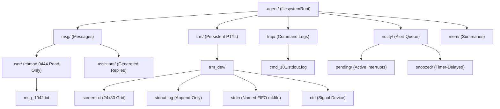
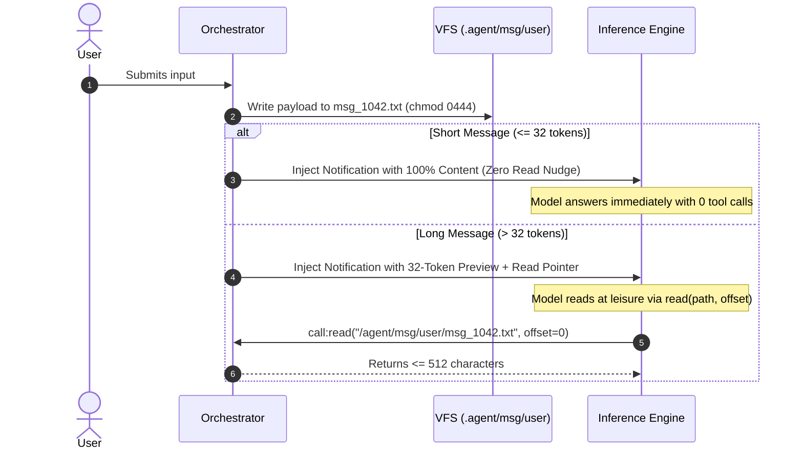
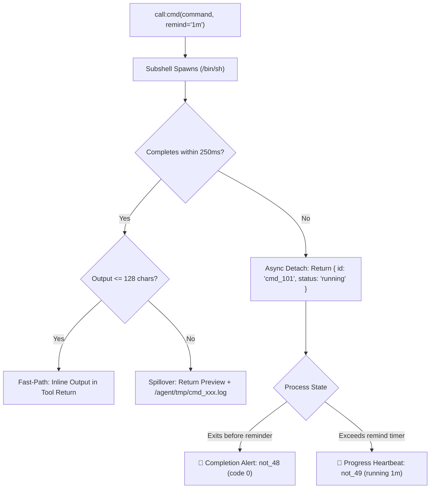
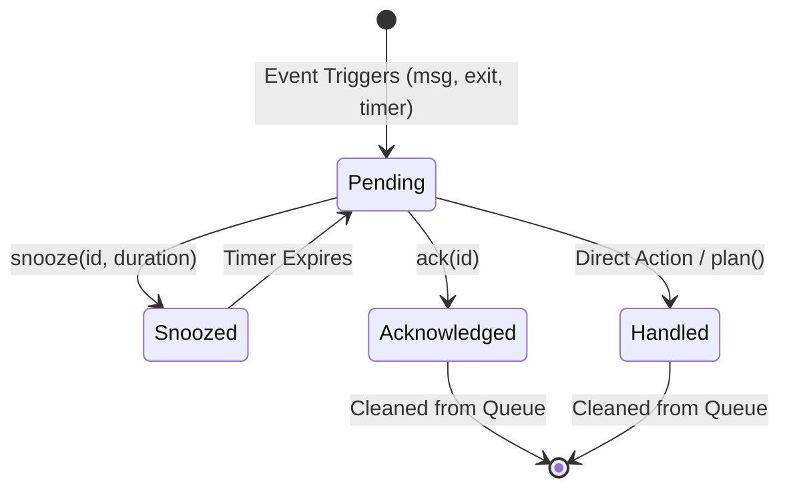

# Streaming Tooling & Virtual File Subsystem Architecture

## 1. Executive Summary & Problem Formulation

Large Language Models typically interact with their operating environment through **monolithic synchronous tool calls** and **unilateral context pushes**. When a user types or pastes a massive document, or when a tool produces megabytes of output, the entire payload is injected directly into the active prompt turn.

In a continuous streaming architecture with a finite physical KV cache (such as our 4,096-slot dynamic ring buffer), this traditional pattern causes catastrophic failures:

1. **Context Shockwaves**: A user pasting a 3,000-token log or document instantly obliterates the model's active working memory, forcing immediate eviction of critical macro-reasoning anchors.
2. **Interactive Latency Tax**: Forcing trivial inputs (`"yes"`, `"stop"`) or fast commands (`ls`, `pwd`) through multi-turn paging and heavy JSON tool wrappers introduces hundreds of milliseconds of unnecessary round-trip delay.
3. **Attentional Blindness vs. Asymmetric Interrupts**: Models either get derailed by unprompted context injections or completely ignore background jobs and peripheral updates while trapped in deep deliberation loops.
4. **Zombie Process Accumulation**: Spawning captive terminal sessions for simple one-off commands leaks pseudo-terminals (PTYs), processes, and disk artifacts.

This document specifies the **Streaming Tooling & Virtual File Subsystem (VFS)**. Grounded in the Unix philosophy (*"everything is a stream/file"*), it provides:
- Fixed-window notification previews (~32 tokens) that eliminate the latency tax on small inputs while shielding the KV cache from large document blowouts.
- An opinionated, capped `read` tool ($\le 512$ characters / ~128 tokens) enforcing bite-sized ingestion.
- A dual-mode command execution engine separating fast subshells ($\le 250\text{ ms}$) from persistent interactive PTY sessions.
- An asynchronous interrupt controller featuring `ack()` and `snooze()` with uniform, typed semantic string IDs (`not_`, `cmd_`, `step_`, `trm_`, `msg_`).

---

## 2. The Virtual File System (VFS) Layout

Rather than emulating a synthetic, in-memory virtual filesystem, the subsystem leverages **real Linux OS primitives** (directories, file permissions, append-only files, and named FIFOs) rooted at a configurable path (`filesystemRoot` in `config.json`).



### Filesystem Structure

```
.agent/
├── msg/
│   ├── user/
│   │   ├── msg_1041.txt          <-- chmod 0444 (Read-Only)
│   │   └── msg_1042.txt          <-- chmod 0444 (Read-Only)
│   └── assistant/
│       └── msg_1042_reply.txt    <-- Generated replies
├── trm/
│   └── trm_server/
│       ├── screen.txt            <-- Live 24x80 rendered text grid
│       ├── stdout.log            <-- Raw append-only historical output stream
│       ├── stdin                 <-- Named FIFO for piping interactive input
│       └── ctrl                  <-- Virtual device for control keys (ctrl+c, esc)
├── tmp/
│   ├── cmd_101.stdout.log        <-- Ephemeral log for background subshell
│   └── cmd_102.stdout.log
└── notify/
    ├── pending/
    │   └── not_47               <-- Active interrupt descriptor
    └── snoozed/
        └── not_48               <-- Suppressed until timer wake
```

### OS Security & Access Guarantees
- **Immutability of Inbound Messages**: Inbound user turns written to `.agent/msg/user/` are explicitly marked read-only via `chmod 0444`. Any attempt by the model or subshell to overwrite or modify previous user input fails with `EACCES` (`Permission denied`).
- **Isolation**: Each agent instance operates inside its own isolated `filesystemRoot` (e.g. `./.agent` or `/agent/worker_1`).

---

## 3. Input Channels: Notifications with Preview vs. Pull Streaming

To protect the model's 4,096-slot dynamic ring buffer from context shockwaves, user messages are never pushed unconditionally into the model's active attention window. Instead, the orchestrator writes the full payload to disk and formats a **fixed-size preview notification (~32 tokens)**.



### Notification Formatting Rules

#### A. Atomic / Short Messages ($\le 32$ tokens)
When the message fits entirely within the 32-token preview budget:
```
<|turn>user
[Event: not_101 | Source: msg/user/msg_1041.txt]
Please check if the test suite passes on the latest commit.
<turn|>
```
- **The routing envelope and message payload are cleanly separated**.
- No truncation ellipsis, no file size tag, no `read` tool nudge.
- The model immediately responds or executes actions with **zero tool overhead**.

#### B. Large / Structured Documents ($> 32$ tokens)
When a user pastes a large document, stack trace, or database schema:
```
<|turn>user
[Event: not_102 | Source: msg/user/msg_1042.txt | 1,840 tok | read: msg/user/msg_1042.txt]
CREATE TABLE users (id UUID PRIMARY KEY, email TEXT UNIQUE... [Truncated. Use read({ path: "msg/user/msg_1042.txt" }) to inspect full content]
<turn|>
```
- The model receives immediate situational awareness without KV cache pollution.
- The model pulls the content in bounded chunks using `read` only when it is ready.

---

## 4. Uniform Semantic Identifier Taxonomy

To prevent cross-namespace collisions and eliminate hallucination in small models (Gemma 12B), all runtime entities use typed, prefixed string identifiers:

| Prefix | Resource Type | Example | Consumer Tools |
| :--- | :--- | :--- | :--- |
| **`not_`** | Notification / Interrupt | `not_47` | `ack("not_47")`, `snooze("not_47", "2m")` |
| **`cmd_`** | Ephemeral Subshell Command | `cmd_101` | `cmd_kill("cmd_101")`, `snooze("cmd_101", "1m")` |
| **`plan_`** | Hierarchical Macro Plan | `plan_1001` | `plan(...)` |
| **`step_`** | Discrete Plan Step | `step_1001.2` | `done("step_1001.2")`, `snooze("step_1001.2", "5m")` |
| **`trm_`** | Persistent Interactive PTY | `trm_dev`, `trm_0` | `trm_open(...)`, `trm_close(...)`, `key(...)` |
| **`msg_`** | Inbound User Message | `msg_1042` | `read("/agent/msg/user/msg_1042.txt")` |

---

## 5. Execution Architecture: Ephemeral Subshells vs. Persistent PTYs

Commands fall into two distinct operational profiles: one-off commands (`ls`, `git`, `grep`, `zig build`) and long-running interactive sessions (`npm run dev`, `python -i`, `htop`). Treating both uniformly leads to resource exhaustion or loss of interactivity.



### 1. Ephemeral Commands: `cmd(command, [remind="1m"])`

- **PTY Allocation**: None. Executes directly via standard subshell pipes.
- **Fast-Path Inline Return ($\le 250\text{ ms}$ & $\le 128\text{ chars}$)**:
  Returns directly in the tool result payload:
  ```json
  { "exit_code": 0, "output": "src/\nbuild.zig\nREADME.md\n" }
  ```
- **Spillover Return ($\le 250\text{ ms}$ & $> 128\text{ chars}$)**:
  Streams output to `.agent/tmp/cmd_101.stdout.log` and returns a preview:
  ```json
  {
    "id": "cmd_101",
    "exit_code": 0,
    "preview": "test 1... ok\ntest 2... ok\n[31 tests passed]",
    "log": "/agent/tmp/cmd_101.stdout.log"
  }
  ```
- **Async Detach ($> 250\text{ ms}$)**:
  If still executing at 250ms, the tool returns immediately, detaching the process:
  ```json
  {
    "id": "cmd_101",
    "status": "running",
    "pid": 48201,
    "log": "/agent/tmp/cmd_101.stdout.log",
    "remind": "1m"
  }
  ```
- **The `remind` Parameter**:
  - Accepts standard duration strings (`"30s"`, `"1m"`, `"10m"`) or `false`.
  - Default: `"1m"`. Prevents hung or forgotten background processes.
  - If process exits before the reminder, the timer is cleared and a completion alert is queued.
  - If process is still active when the reminder pops, an in-progress heartbeat alert fires.
  - `remind: false`: Intended for detached GUI applications launched on the user's behalf (`x-terminal-emulator`, `code .`).

### 2. Persistent Interactive Sessions: `trm_open(name, [command])`

When an application requires persistent state, cursor addressing, or ANSI terminal sequences:
- **PTY Allocation**: Allocates a full 24×80 virtual terminal emulator.
- **Virtual Console Device Node**:
  - `.agent/trm/<name>/screen.txt`: The live, fully rendered 2D plain-text grid with all ANSI escapes resolved.
  - `.agent/trm/<name>/stdout.log`: Complete raw append-only output history.
  - `.agent/trm/<name>/stdin`: Named FIFO (`mkfifo`) for streaming standard text input.
  - `.agent/trm/<name>/ctrl`: Virtual control device for sending symbolic keys.

---

## 6. The Notification & Interrupt State Machine

Notifications represent actionable interrupts (user inputs, process completions, timer expirations) managed by an explicit queue.



### Notification Handling Primitives

1. **`ack(id)` (Permanent Dismissal)**:
   - Dismisses the alert permanently from the pending queue.
   - Cleans up associated ephemeral log files (`/agent/tmp/cmd_xxx.log`).
   - Use case: *"I have noted this information and require no further action."*

2. **`snooze(id, [duration="1m"])` (Temporary Suppression)**:
   - Suppresses the alert from the turn header for the specified duration.
   - Automatically re-queues the alert when the timer elapses.
   - Unified target: Can snooze notification IDs (`not_47`), command IDs (`cmd_101`), or plan step IDs (`step_1001.2`).
   - Use case: *"I see the build is still running / the user sent a secondary note, but I am in the middle of writing a function. Remind me in 1 minute."*

3. **Turn Header Injection**:
   Every turn begins with an alert rollup until all pending notifications are cleared:
   ```
   [🔔 PENDING ALERTS:
     - not_47 (msg_1042): "Secondary DB offline"
     - not_48 (cmd_101): "zig build test" exited with code 0]
   ```

---

## 7. Tool Reference Specification

### `read(path, [offset=0])`
Bounded streaming reader.
- **Parameters**:
  - `path` (string, required): Absolute or relative path under `filesystemRoot`.
  - `offset` (number, optional, default: 0): Byte/character offset to begin reading.
- **Output**:
  - Raw string slice strictly capped at **$\le 512$ characters (~128 tokens)**.
  - Returns `""` (empty string) on EOF.
- **Constraints**: No file metadata padding (size, line count) in the return payload.

### `cmd(command, [remind="1m"])`
Spawns an ephemeral subshell command.
- **Parameters**:
  - `command` (string, required): Shell command line to execute.
  - `remind` (string | boolean, optional, default: `"1m"`): Timeout duration before generating an alert. Set to `false` for detached GUI launches.
- **Output**:
  - If $\le 250\text{ ms}$ & $\le 128\text{ chars}$: `{ "exit_code": 0, "output": "..." }`.
  - If $\le 250\text{ ms}$ & $> 128\text{ chars}$: `{ "id": "cmd_xxx", "exit_code": 0, "preview": "...", "log": "..." }`.
  - If $> 250\text{ ms}$: `{ "id": "cmd_xxx", "status": "running", "pid": 1234, "log": "...", "remind": "1m" }`.

### `cmd_kill(id, [signal="SIGTERM"])`
Terminates an asynchronous subshell command.
- **Parameters**:
  - `id` (string, required): Identifier (e.g. `"cmd_101"`).
  - `signal` (string, optional, default: `"SIGTERM"`): Signal to send (`"SIGTERM"`, `"SIGKILL"`, `"SIGINT"`).

### `trm_open(name, [command])`
Allocates a persistent interactive PTY session.
- **Parameters**:
  - `name` (string, required): Semantic identifier (e.g. `"trm_dev"`, `"trm_repl"`).
  - `command` (string, optional): Initial shell command to execute.

### `trm_close(name)`
Closes a persistent PTY session and releases its device folder.
- **Parameters**:
  - `name` (string, required): Semantic identifier (e.g. `"trm_dev"`).

### `key(trm, name)`
Sends symbolic control keys or escape sequences to a persistent PTY.
- **Parameters**:
  - `trm` (string, required): Target terminal name (e.g. `"trm_dev"`).
  - `name` (string, required): Key identifier (`"ctrl+c"`, `"enter"`, `"esc"`, `"up"`, `"down"`, `"tab"`).

### `ack(id)`
Permanently dismisses a pending alert.
- **Parameters**:
  - `id` (string, required): Alert identifier (`"not_47"`).

### `snooze(id, [duration="1m"])`
Suppresses an alert, command reminder, or plan step until a timer elapses.
- **Parameters**:
  - `id` (string, required): Identifier (`"not_47"`, `"cmd_101"`, `"step_1001.2"`).
  - `duration` (string, optional, default: `"1m"`): Delay window (`"30s"`, `"2m"`, `"1h"`).

### `plan(brief, steps)`
Externalizes macro-goals and sub-tasks into the orchestrator state machine.
- **Parameters**:
  - `brief` (string, required): High-level plan objective.
  - `steps` (array of strings, required): Ordered list of plan steps.
- **Side Effect**: Emits `OP_MEM_COMMIT` to snapshot the engine's KV cache into `.episodic.mem` and clears working set saturation.

---

## 8. Summary of Latency & Memory Footprint

| Mechanism | Conventional Push Paradigm | Streaming VFS Tooling |
| :--- | :--- | :--- |
| **Large Input Ingestion** | Full text pushed into KV cache ($\Delta S > 3000$) | 16-token preview alert; read in 512-char chunks |
| **Trivial Reply Latency** | 1 forward pass (~35ms) | 1 forward pass (~35ms) via preview bypass |
| **Fast Subshell Latency** | Full blocking PTY allocation (~80ms) | Subshell pipe fast-path inline return ($\le 250\text{ ms}$) |
| **KV Cache Blowout Risk** | Critical (immediate FIFO eviction) | Zero (unaltered working memory until pulled) |
| **Hung Process Risk** | High (orphaned unmonitored children) | Zero (default 1m reminder + shutdown exit hooks) |
